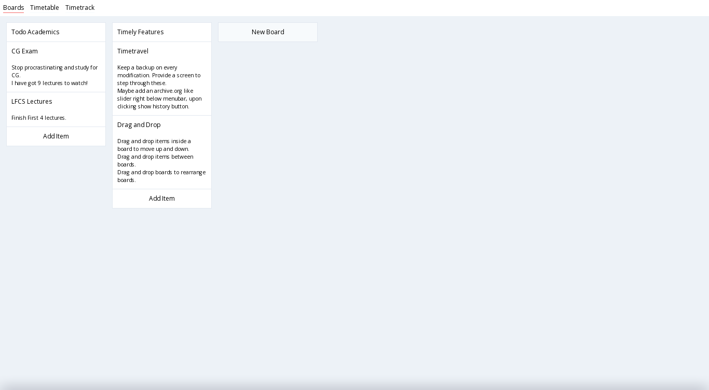
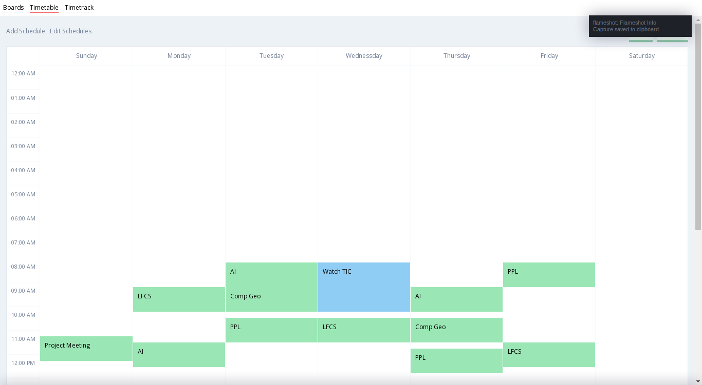

# Timely
Kanban board, Timetable, Weekly scheduler. Built using Electron and Vue and TailwindCSS.

Currently in ~alpha~ dog fooding phase.
Issues and PRs welcome.

## Run
```
cd timely
yarn install
yarn dev
```

## Screenshots




## Need help
* [ ] yarn script to build a simple runnable package, like AppImage.
* [ ] Improve the styles in general. 

## License
GPLv3
